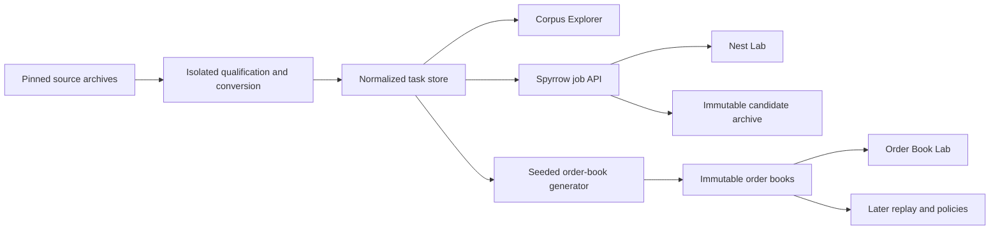

# Dataset and Research Workbench Design

**Status:** Approved 2026-08-17

## Objective

Give YieldForge a credible data foundation and a local visual research workbench. The system should use authentic irregular nesting tasks wherever available, label every generated field honestly, let a researcher watch Spyrrow acquire candidate nests, and later expose chronological remnant-reuse experiments in the same interface.

All implementation remains inside the single long-lived `yf/` tree. Project and developer documentation remains in `Docs/`.

## Research conclusion

No clearly open source currently combines all of the following in one ready-made corpus:

- irregular part geometry;
- genuine chronological manufacturing orders;
- quantities and task groupings;
- material and stock identity;
- remnant creation and reuse history;
- economic fields.

The closest open source is the Lectra/Lallier nesting-task corpus. It contains 100,000 tasks constructed from real customer nesting data, including polygon coordinates, task-to-part membership, sheets, constraints, solver duration, and achieved efficiency. Its chronology, materials, costs, and remnant history are absent. The dataset is openly downloadable from Zenodo under CC BY 4.0.

The evidence program will therefore use real Lectra geometry and real within-task composition as its backbone, then generate only the missing chronology and economic context with explicit provenance.

The completed qualification census is recorded in [[Lectra Corpus Audit]]. It found coherent keys and joins across all 100,000 tasks, but it did not establish the semantics of the 15 opaque constraint codes or interpret the literal source unit label `m^-4`. The first visible Lectra nest must therefore pair a `source_lossless` record with a separate `runnable_with_explicit_assumptions` projection; it is not `directly_supported` evidence.

## Source roles

| Source | Role | Claim ceiling |
| --- | --- | --- |
| Lectra/Lallier 100,000-task corpus | Primary geometry and task reservoir | Authentic customer geometries and within-task composition; not a historical order book |
| Sparrow/Gardeyn instances | Supplemental solver and geometry regression fixtures | Real-world-derived static jobs; no chronological evidence |
| ESICUP irregular corpora | Supplemental geometric diversity and comparability | Static benchmark behavior; no order-history evidence |
| Multi-stage 2D-CSPUL instances | Temporal and leftover-accounting reference | Constructed rectangular scenarios; not irregular manufacturing history |
| BROMRO2 instances and code | Forward-looking multi-period method reference | Research semantics; reuse terms require separate license review |
| Direct researcher or manufacturer release | Future real-history evidence layer | Determined by the exact fields, transformations, and terms received |

## Evidence layers

### 1. Source-real static corpus

The downloaded Lectra files remain unchanged and content-addressed. This layer is source evidence, not an application database. ESICUP and Sparrow sources remain separately identified rather than being blended into the Lectra corpus.

### 2. Normalized task corpus

An importer converts source records into safe, queryable YieldForge data while preserving:

- source version, file checksum, and source record identifiers;
- coordinate units and all transformations;
- task, part, shape, sheet, and constraint relationships;
- geometry and constraint features not yet supported by Spyrrow;
- support status and explicit exclusion reasons.

The canonical model must be able to preserve richer geometry than the current solver adapter can consume. A Spyrrow limitation must not become silent source-data loss.

### 3. Hybrid order books

A deterministic generator arranges authentic source tasks into chronological streams and adds only missing fields. Every field is labeled as one of:

- `observed` — directly present in the source;
- `derived` — deterministically calculated from source data;
- `generated` — sampled by a versioned seeded generator;
- `assumed` — selected as an explicit experimental or economic rule.

### 4. Controlled validation suites

Separate, deliberately constructed streams create negative controls and favorable regimes. Rectangular multi-stage datasets validate temporal and accounting semantics but do not support claims about irregular geometry.

## Source acquisition and safety

The four Lectra files total roughly 188 MB (about 179 MiB) and use gzip-compressed Python pickle files. Raw data should not be committed to Git. The repository will instead contain a pinned source manifest, published checksums, a reproducible fetch process, and small normalized fixtures.

Because pickle is executable rather than a passive interchange format, source inspection and conversion must occur in a disposable, network-disabled environment. The normal application must never read the source pickle files. After validation, the data should be converted into an open, safe format suitable for analytical queries.

The qualification pass must establish:

- actual row counts and join integrity;
- coordinate-unit semantics;
- contour, hole, and compound-shape representation;
- constraint-type inventory and frequency;
- task-size and shape-recurrence distributions;
- malformed or ambiguous record counts;
- exact coverage of the current Spyrrow adapter.

Each source task receives one support classification:

1. directly supported;
2. losslessly convertible after a canonical-model extension;
3. ingestible and viewable but not yet solvable;
4. corrupt or semantically ambiguous.

## Order-book generator

### Inputs

- qualified normalized task partition;
- generator specification and seed;
- recurrence regime;
- horizon and arrival process;
- material and economic profile;
- information-visibility rules.

### Outputs

- an immutable manifest;
- a part and geometry catalog;
- timestamped order events;
- observed-versus-generated provenance for every field family;
- measured diagnostics for the realized stream;
- a content hash and generator identity.

### Regimes

- **No-signal:** future work is unique or geometrically incompatible.
- **Exact recurrence:** identical source shapes return.
- **Family recurrence:** related shapes return using measured geometric clusters.
- **Correlated bundles:** recurring combinations preserve authentic task composition.
- **High-mix:** weak recurrence and many one-off shapes.
- **Regime shift:** one family pool declines while another grows.

A generator request is not accepted merely because it names a regime. The realized book must be measured and rejected if recurrence, uniqueness, concentration, task-size, or load diagnostics do not match the declared construction.

Generator-only family labels and future events remain unavailable to ordinary policies. The baseline receives only information released as of the current event; the oracle receives the realized future through a separate controlled interface.

### Initial suites

- Three tiny hand-inspectable books for development.
- Multiple seeded books per regime for screening.
- A frozen evaluation suite only after M0 rules and generator diagnostics are approved.

## Local research workbench

The frontend will be a browser-based local research application contained within `yf/`. A Python backend remains the sole owner of canonical data, solver execution, and immutable archives. The frontend never reads raw source files or reimplements solver logic.

### Corpus Explorer

- Browse and search the Lectra tasks.
- Filter by sheet, part count, constraints, geometry features, and support status.
- Display geometry thumbnails and task summaries.
- Show source provenance, transformations, and exclusion reasons.

### Nest Lab

- Select a normalized task and bounded solver configuration.
- Run Spyrrow and receive progressive feasible candidates.
- Render the sheet and exact placed geometry.
- Browse candidates by width, density, seed, report type, and candidate ID.
- Persist accepted runs through the existing immutable archive boundary.

SVG is the preferred first renderer because it provides exact polygon paths, zooming, selection, tooltips, and even-odd paths for later multi-contour support.

### Order Book Lab

- Generate or open a deterministic order book.
- Inspect its timeline, tasks, recurrence, and load diagnostics.
- Distinguish observed, derived, generated, and assumed fields visually.
- Select an event and jump directly to its available candidate nests.

### Later milestone views

- M3: residual components and accounting overlays.
- M4: remnant-fit inspection.
- M5: inventory timeline and deterministic replay.
- M7-M8: baseline-versus-oracle comparison.
- M10: experiment results and decision evidence.

## Architecture and data flow

For a large local corpus, normalized records should use columnar files plus an embedded analytical query layer. The backend should provide bounded queries and one-way solver-progress streaming to the browser. Long-running solver jobs require explicit time limits, cancellation, and durable terminal status.

## Errors are evidence

The workbench must expose rather than hide:

- unsupported constraints;
- ambiguous units;
- invalid or lossy geometry transformations;
- tasks not supported by the current solver;
- solver failures and timeouts;
- candidates rejected by physical-sheet or feasibility rules;
- generator requests whose realized diagnostics miss their declared regime.

No importer may silently repair, flatten, discard, or reinterpret source semantics.

## Verification gates

- Published source checksums and counts reconcile.
- Normalized geometry round-trips within declared tolerances.
- Every source record has a support status.
- Rendered geometry matches solver placement transforms on golden fixtures.
- Spyrrow integration remains live-tested.
- Generator output is deterministic for a manifest and seed.
- Calibration and evaluation partitions cannot leak.
- Baseline interfaces cannot access future events or hidden generator labels.
- Every persisted book and candidate archive passes content-hash verification.

## Implementation order

1. Qualify the Lectra corpus and publish the capability census.
2. Import one representative, lossless, solver-supported slice.
3. Build Corpus Explorer and Nest Lab around that slice.
4. Expand normalized ingestion and support coverage across the corpus.
5. Build the deterministic hybrid order-book generator.
6. Add Order Book Lab to the same workbench.
7. Pursue non-blocking outreach for anonymized chronology, materials, and costs.

This sequence gets authentic geometry and a visible nest early without generating temporal experiments from misunderstood source data.

## Out of scope for the first slice

- Hosted multi-user deployment, authentication, or customer accounts.
- Product-style quoting, purchasing, or CAM workflows.
- Claims that generated chronology represents a factory's actual arrival process.
- Residual geometry, remnant reuse, replay, or oracle results before their milestones.
- Silent approximation of unsupported source constraints.

## Primary sources

- [Lectra/Lallier 100,000-task Zenodo release](https://zenodo.org/records/7030786)
- [Associated real-customer dataset paper](https://link.springer.com/article/10.1007/s10845-023-02084-6)
- [Sparrow paper and real-world-derived instances](https://arxiv.org/html/2509.13329v1)
- [ESICUP irregular datasets](https://github.com/ESICUP/datasets/blob/main/2d_irregular/README.md)
- [Multi-stage 2D-CSPUL dataset](https://data.mendeley.com/datasets/6jpyk7pzpv/1)
- [2D-CSPUL usable-leftover dataset](https://data.mendeley.com/datasets/ddc79swng4/1)
- [BROMRO2 forward-looking multi-period repository](https://github.com/oberlan/bromro2)
